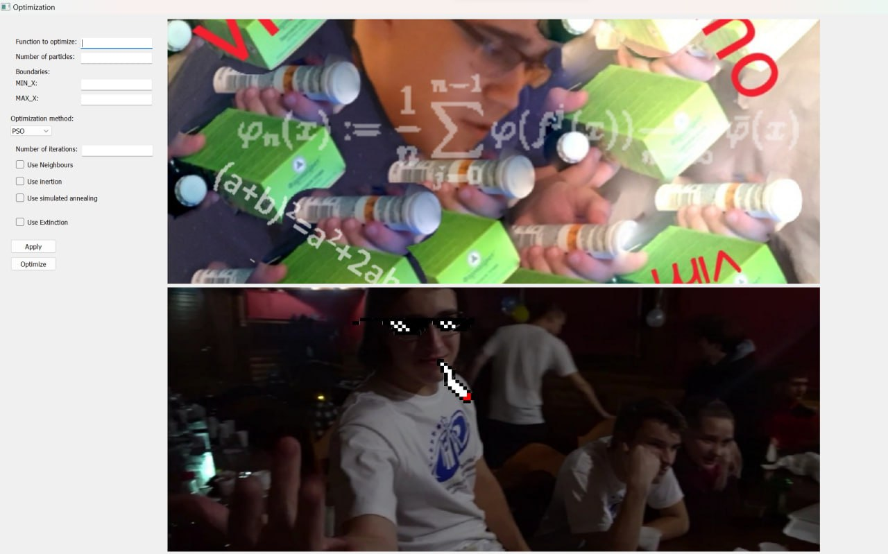

# PSO GA optimization UI

## Описание
В репозитории программа с графическим интерфейсом, созданная с использованием библиотеки PyQt5. Она предназначена для выполнения оптимизации с использованием алгоритмов роя частиц и генетического алгоритма (PSO и GA).

## Особенности
- **Графический интерфейс**: Интуитивно понятный и удобный интерфейс на базе PyQt5.
- **Алгоритмы оптимизации**: Включает в себя реализацию алгоритмов оптимизации PSO (Particle Swarm Optimization) и GA (Genetic Algorithm).
- **Настройка параметров**: Пользователи могут настраивать параметры алгоритмов для проведения оптимизации.
- **Визуализация**: Возможность визуализации процесса оптимизации в реальном времени.
- **EXTRA**: Добавлены мемы

## Применение
Программа может быть использована для решения различных задач оптимизации, таких как оптимизация функций, поиск оптимальных решений в инженерных и научных приложениях, и многое другое.

## Начало работы
Для начала работы с программой необходимо клонировать репозиторий и установить зависимости через poetry.

